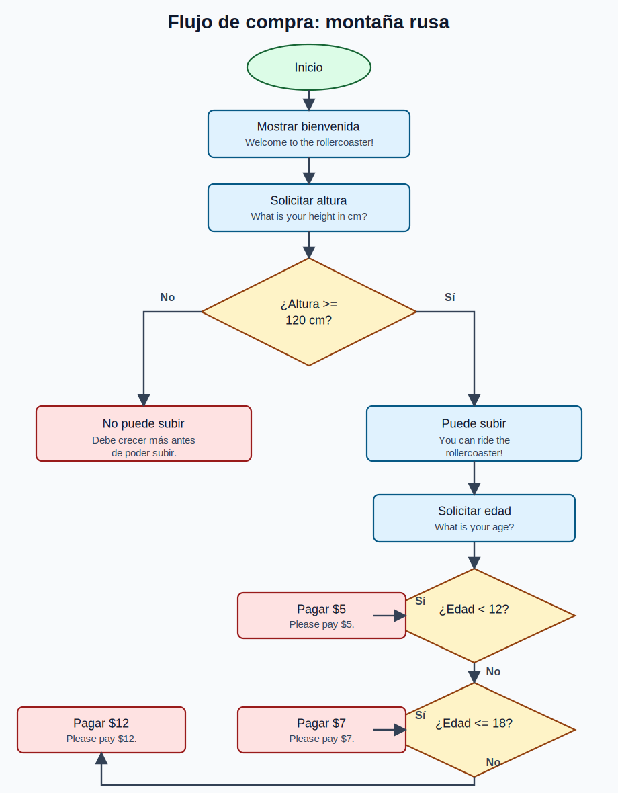
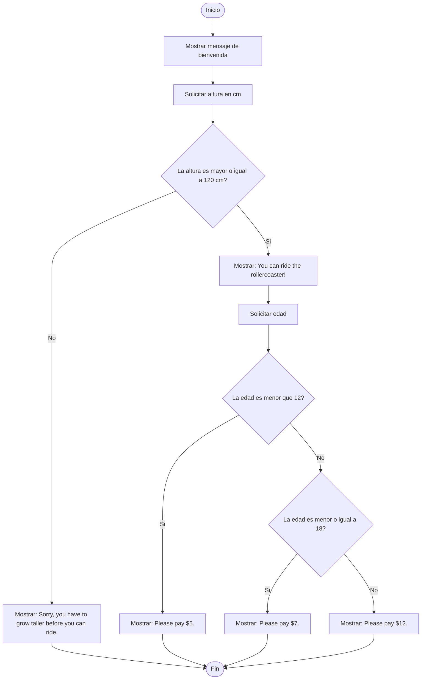

# Diagrama de flujo: montaña rusa

Este diagrama representa la lógica del archivo `day3.py`.

```mermaid
flowchart TD
    A([Inicio]) --> B[Mostrar mensaje de bienvenida]
    B --> C[Solicitar altura en cm]
    C --> D{La altura es mayor o igual a 120 cm?}
    D -- No --> E[Mostrar: Sorry, you have to grow taller before you can ride.]
    E --> F([Fin])
    D -- Si --> G[Mostrar: You can ride the rollercoaster!]
    G --> H[Solicitar edad]
    H --> I{La edad es menor que 12?}
    I -- Si --> J[Mostrar: Please pay $5.]
    I -- No --> K{La edad es menor o igual a 18?}
    K -- Si --> L[Mostrar: Please pay $7.]
    K -- No --> M[Mostrar: Please pay $12.]
    J --> F
    L --> F
    M --> F
```
